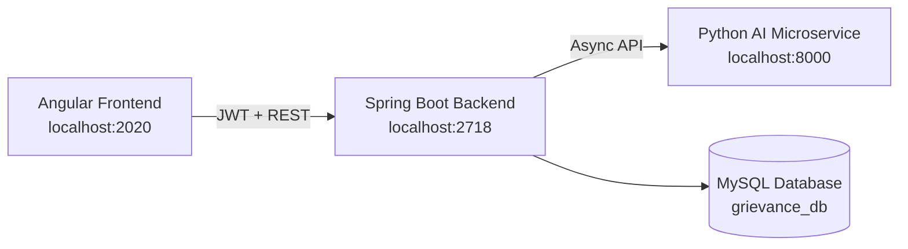

# AI-Based Student Grievance Management System

A full-stack grievance management platform designed for academic institutions to streamline complaint reporting, review workflows, and administrative oversight. The system supports role-based access for students, faculty, college administrators, and super admins, while integrating AI-assisted analysis for classification, duplicate detection, and risk assessment.

<p align="center">
  
  
  
  
  
</p>

## Overview

This project helps institutions manage student grievances through a structured workflow:

- Students can submit, review, and update grievances
- Faculty members can review assigned complaints and add resolution notes
- College administrators manage departmental workflows and grievance assignments
- Super admins oversee the entire system and manage institutional configuration
- AI-based analysis supports priority estimation, duplicate detection, and anomaly flagging

## Architecture



## Features

### Student

- Submit grievances with title, description, category, and evidence
- Track complaint status and history
- View duplicate/common grievance suggestions
- Edit pending grievances
- Access AI-generated analysis and risk scores

### Faculty

- View grievances assigned to them
- Update grievance status and add resolution notes
- Validate reported incidents
- Handle grievance resolution responsibilities when assigned

### College Admin

- Monitor college-level grievance analytics
- View department and user data
- Assign grievances to faculty manually or automatically
- Manage faculty resolver permissions
- Trigger AI re-analysis when needed

### Super Admin

- Manage global dashboard analytics
- Create and update colleges
- Generate registration tokens for onboarding users
- Review system-wide reports and institutional data

### AI Capabilities

The AI microservice can assist with:

- Category prediction with confidence scores
- Priority prediction with confidence scores
- Fake complaint detection
- Duplicate detection and similarity scoring
- Anomaly detection
- Risk assessment summaries

If the AI service is unavailable, the platform still saves the grievance and continues with non-AI workflows.

## Technology Stack

| Layer | Technology | Version |
| --- | --- | --- |
| Frontend | Angular | 17 |
| Frontend Charts | Chart.js + ng2-charts | 4.4 / 5.0 |
| Backend | Spring Boot | 3.2.0 |
| Backend Language | Java | 17 |
| Persistence | Spring Data JPA / Hibernate | - |
| Security | Spring Security + JJWT | 0.11.5 |
| Database | MySQL | 8 |
| Build Tool | Maven | 3.x |
| AI Service | Python | External service |

## Project Structure

```text
Student-Grievance-Management-System/
├── backend/
│   ├── pom.xml
│   └── src/
│       └── main/
│           ├── java/com/grievance/management/
│           │   ├── config/
│           │   ├── controller/
│           │   ├── dto/
│           │   ├── entity/
│           │   ├── enums/
│           │   ├── exception/
│           │   ├── repository/
│           │   ├── security/
│           │   ├── service/
│           │   └── util/
│           └── resources/
│               └── application.properties
├── frontend/
│   ├── package.json
│   ├── angular.json
│   ├── tsconfig.json
│   └── src/
│       └── app/
│           ├── auth/
│           ├── student/
│           ├── faculty/
│           ├── college-admin/
│           ├── super-admin/
│           ├── core/
│           └── shared/
├── README.md
└── .gitignore
```

## Prerequisites

Before running the application, make sure you have the following installed:

- Java JDK 17+
- Maven 3.6+
- Node.js 18+
- npm 9+
- MySQL 8.0+
- Angular CLI 17+

### Verify installation

```bash
java -version
mvn -version
node -v
npm -v
mysql --version
ng version
```

If Angular CLI is not installed:

```bash
npm install -g @angular/cli@17
```

## Quick Start

### 1. Database Setup

Start MySQL and create the database:

```sql
CREATE DATABASE grievance_db;
```

The application uses Hibernate schema auto-update:

```properties
spring.jpa.hibernate.ddl-auto=update
```

### 2. Backend Setup

Navigate to the backend folder:

```bash
cd backend
```

Update the database configuration in:

```text
backend/src/main/resources/application.properties
```

Example:

```properties
spring.datasource.url=jdbc:mysql://localhost:3306/grievance_db
spring.datasource.username=root
spring.datasource.password=YOUR_MYSQL_PASSWORD
jwt.secret=YOUR_BASE64_SECRET_KEY
jwt.expiration=86400000
server.port=2718
```

Generate a secure JWT secret:

On Linux/macOS:

```bash
openssl rand -base64 32
```

On Windows PowerShell:

```powershell
[Convert]::ToBase64String((1..32 | ForEach-Object { [byte](Get-Random -Max 256) }))
```

Run the backend:

```bash
mvn spring-boot:run
```

Or build and run the JAR:

```bash
mvn clean package
java -jar target/grievance-management-1.0.0.jar
```

Backend URL:

```text
http://localhost:2718
```

### 3. AI Microservice Setup

The AI service is an external Python service and is not bundled in this repository. The backend communicates with:

```text
POST http://localhost:8000/analyze
```

Expected request payload:

```json
{
  "title": "string",
  "description": "string",
  "grievance_id": "string"
}
```

Expected response example:

```json
{
  "category_confidence": 0.92,
  "priority_confidence": 0.85,
  "is_fake": false,
  "fake_confidence": 0.03,
  "is_duplicate": false,
  "duplicate_of_id": null,
  "similarity_score": null,
  "is_anomaly": false,
  "anomaly_score": 0.1,
  "notes": "string"
}
```

If the AI service is down, the grievance is still recorded and the system continues without AI-based analysis.

### 4. Frontend Setup

Navigate to the frontend folder:

```bash
cd frontend
npm install
npm start
```

Frontend URL:

```text
http://localhost:2020
```

The Angular app proxies `/api/**` requests to the backend at:

```text
http://localhost:2718
```

For a production build:

```bash
npm run build
```

## Configuration

### Main backend configuration

File:

```text
backend/src/main/resources/application.properties
```

| Property | Default | Description |
| --- | --- | --- |
| `server.port` | `2718` | Backend server port |
| `spring.datasource.url` | `jdbc:mysql://localhost:3306/grievance_db` | MySQL connection |
| `spring.datasource.username` | `root` | Database username |
| `spring.datasource.password` | Local value | Database password |
| `spring.jpa.hibernate.ddl-auto` | `update` | Schema auto-update |
| `jwt.secret` | Placeholder | Base64 JWT secret |
| `jwt.expiration` | `86400000` | JWT expiry in milliseconds |
| `spring.servlet.multipart.max-file-size` | `10MB` | Max upload file size |
| `spring.servlet.multipart.max-request-size` | `50MB` | Max request size |
| `file.upload-dir` | `uploads` | Evidence storage directory |
| `ai.server.url` | `http://localhost:8000` | AI service URL |

> Important: never commit sensitive secrets like database passwords or JWT keys to source control. Use environment variables or local secrets for production deployment.

## User Roles and Access

| Role | Description | Default Route |
| --- | --- | --- |
| `STUDENT` | Submit and track grievances | `/student/dashboard` |
| `FACULTY` | Review assigned grievances | `/faculty/dashboard` |
| `COLLEGE_ADMIN` | Manage college operations | `/college-admin/dashboard` |
| `SUPER_ADMIN` | Full-system administration | `/super-admin/dashboard` |

## First-Time Super Admin Setup

There is no default seeded super admin account. The initial account must be created directly in the database.

### 1. Generate a BCrypt hash

```java
System.out.println(new BCryptPasswordEncoder().encode("yourPassword"));
```

### 2. Insert the super admin user

```sql
INSERT INTO users (email, password, first_name, last_name, role, enabled)
VALUES ('superadmin@system.com', '$2a$10$YOUR_BCRYPT_HASH', 'Super', 'Admin', 'SUPER_ADMIN', true);
```

### 3. Create the admin profile

```sql
INSERT INTO super_admins (user_id)
VALUES (LAST_INSERT_ID());
```

### 4. Login

Open the app in a browser:

```text
http://localhost:2020
```

Then sign in with the created super admin credentials.

## Registration Flow

Registration is not open by default. New users must use a valid registration token generated by a super admin.

```text
Super Admin
    ↓
Generate Registration Token
    ↓
Share Token with User
    ↓
User Opens Registration Page
    ↓
Enter Details + Token
    ↓
Token Validation
    ↓
Account Created
    ↓
JWT Generated
    ↓
Role-based Dashboard
```

### Registration routes

- Student: `/auth/register/student`
- Faculty: `/auth/register/faculty`
- College Admin: `/auth/register/college-admin`

Token rules:

- Single-use
- Valid for 7 days
- Scope-specific to role and college

## API Overview

All API endpoints use the `/api` prefix.

### Authentication

| Method | Endpoint | Description |
| --- | --- | --- |
| `POST` | `/api/auth/login` | Login and receive JWT |
| `POST` | `/api/auth/register/student` | Register a student |
| `POST` | `/api/auth/register/faculty` | Register a faculty member |
| `POST` | `/api/auth/register/college-admin` | Register a college admin |

### Registration tokens

| Method | Endpoint | Role | Description |
| --- | --- | --- | --- |
| `POST` | `/api/tokens/validate` | Public | Validate registration token |
| `POST` | `/api/tokens/generate` | `SUPER_ADMIN` | Generate a token |
| `GET` | `/api/tokens` | `SUPER_ADMIN` | List tokens |

### Grievances

| Method | Endpoint | Role | Description |
| --- | --- | --- | --- |
| `POST` | `/api/grievances` | `STUDENT` | Submit grievance |
| `GET` | `/api/grievances` | Admin | List grievances |
| `GET` | `/api/grievances/my` | `STUDENT` | Fetch student grievances |
| `GET` | `/api/grievances/assigned` | `FACULTY` | View assigned grievances |
| `GET` | `/api/grievances/common` | `STUDENT` | View common/duplicate grievances |
| `GET` | `/api/grievances/{id}` | Authenticated | Fetch grievance details |
| `PUT` | `/api/grievances/{id}` | `STUDENT` | Update grievance |
| `PATCH` | `/api/grievances/{id}/status` | Faculty/Admin | Update grievance status |

### AI analysis

| Method | Endpoint | Role | Description |
| --- | --- | --- | --- |
| `GET` | `/api/ai/analysis/{grievanceId}` | Authenticated | Get AI analysis |
| `POST` | `/api/ai/analyze/{grievanceId}` | Admin | Trigger AI analysis |
| `GET` | `/api/ai/risk/{grievanceId}` | Authenticated | Get risk assessment |

### Admin and reporting endpoints

| Role | Endpoint | Description |
| --- | --- | --- |
| College Admin | `/api/college-admin/dashboard` | Dashboard stats |
| College Admin | `/api/college-admin/departments` | List/create departments |
| College Admin | `/api/college-admin/faculty` | List faculty |
| College Admin | `/api/college-admin/students` | List students |
| College Admin | `/api/college-admin/grievances` | College grievances |
| College Admin | `/api/college-admin/grievances/{id}/assign` | Assign grievance |
| Super Admin | `/api/super-admin/dashboard` | System dashboard |
| Super Admin | `/api/super-admin/colleges` | List/create colleges |
| Super Admin | `/api/super-admin/faculty` | All faculty |
| Super Admin | `/api/super-admin/students` | All students |
| Super Admin | `/api/super-admin/reports` | System analytics |

## Security Notes

- Use JWT-based authentication for secure API access
- Validate all uploaded evidence files and restrict file sizes
- Do not expose secrets or production credentials in code
- Keep database access restricted to authorized environments

## Troubleshooting

### Common issues

#### Backend fails to start

- Check MySQL is running
- Verify database credentials in `application.properties`
- Ensure the `grievance_db` database exists

#### Frontend cannot connect to backend

- Confirm backend is running on port `2718`
- Verify the Angular proxy configuration is correct
- Check CORS and JWT authentication settings

#### AI analysis is unavailable

- Confirm the Python AI microservice is running on `localhost:8000`
- Check the service health and request payload format
- The platform supports graceful degradation when AI is down

## Contributing

Contributions are welcome. If you want to improve the platform:

1. Fork the repository
2. Create a feature branch
3. Commit your changes
4. Open a pull request with a clear description

## License

This project is intended for educational and institutional use. Please review the repository license before production deployment or redistribution.

## Contact

For questions, feature requests, or collaboration opportunities, please open an issue in this repository.

---

Built to support transparent, efficient, and accountable grievance handling in academic environments.
